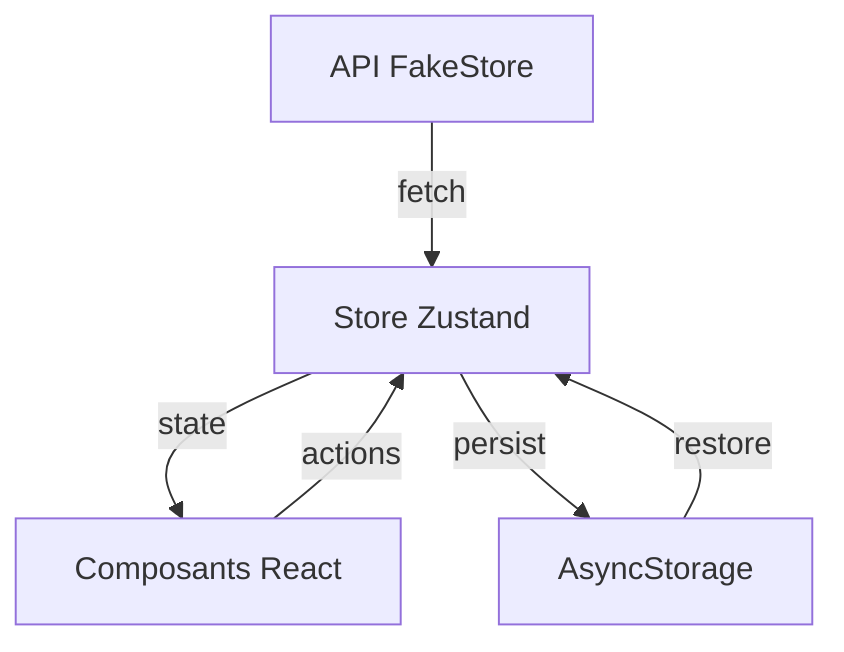

# 🛍️ Zakaria Shop - Application E-commerce Mobile

<div align="center">
  


**Une application e-commerce moderne et performante construite avec Expo Router et Zustand**

[Fonctionnalités](#-fonctionnalités) • [Installation](#-installation) • [Architecture](#-architecture) • [Captures d'écran](#-captures-décran) • [Contribution](#-contribution)

</div>

---

## 📋 Table des matières

- [À propos](#-à-propos)
- [Fonctionnalités](#-fonctionnalités)
- [Technologies utilisées](#-technologies-utilisées)
- [Installation](#-installation)
- [Structure du projet](#-structure-du-projet)
- [Architecture](#-architecture)
- [Scripts disponibles](#-scripts-disponibles)
- [API](#-api)
- [Animations](#-animations)
- [Gestion d'état](#-gestion-détat)
- [Personnalisation](#-personnalisation)
- [Déploiement](#-déploiement)
- [Problèmes connus](#-problèmes-connus)
- [Contribution](#-contribution)
- [Licence](#-licence)

---

## 🎯 À propos

ShopHub est une application mobile e-commerce complète développée avec **Expo** et **React Native**. Elle offre une expérience utilisateur fluide avec des animations soignées, une navigation intuitive et une gestion d'état performante grâce à **Zustand**.

### ✨ Points forts
- 🚀 Navigation rapide avec **Expo Router**
- 🎨 Interface moderne avec gradients et animations
- 💾 Persistance du panier avec AsyncStorage
- 🔄 Pull-to-refresh et états de chargement
- 📱 Design responsive et adaptatif
- 🛒 Gestion complète du panier d'achat
- 🔍 Recherche et filtrage en temps réel

---

## 🎁 Fonctionnalités

### 🏪 Navigation de Produits
- ✅ Liste de produits en grille (2 colonnes)
- ✅ Affichage des détails (image, prix, description, évaluations)
- ✅ Filtrage par catégories dynamiques
- ✅ Recherche en temps réel
- ✅ Pull-to-refresh pour actualiser les données

### 🛒 Expérience d'Achat
- ✅ Ajout au panier avec modal animé (slide-up)
- ✅ Gestion des quantités (+/-)
- ✅ Calcul automatique du prix total
- ✅ Suppression d'articles avec animation
- ✅ Badge panier avec compteur animé
- ✅ Persistance du panier (AsyncStorage)

### 🎨 Interface Utilisateur
- ✅ Splash screen animé (2-3 secondes)
- ✅ Navigation fluide entre écrans
- ✅ Transitions personnalisées
- ✅ Skeleton loaders avec effet shimmer
- ✅ États d'erreur gérés
- ✅ Design moderne avec gradients

### 🔧 Technique
- ✅ Architecture modulaire et scalable
- ✅ Gestion d'état centralisée (Zustand)
- ✅ TypeScript pour la sécurité du code
- ✅ Error boundaries pour la stabilité
- ✅ API REST avec FakeStore API

---

## 🛠️ Technologies utilisées

### Core
- **[Expo](https://expo.dev/)** ~51.0.0 - Framework de développement
- **[React Native](https://reactnative.dev/)** 0.74 - Framework mobile
- **[TypeScript](https://www.typescriptlang.org/)** 5.x - Typage statique
- **[Expo Router](https://expo.github.io/router/)** 3.x - Navigation file-based

### État & Données
- **[Zustand](https://github.com/pmndrs/zustand)** 4.5 - Gestion d'état
- **[Axios](https://axios-http.com/)** 1.x - Requêtes HTTP
- **[AsyncStorage](https://react-native-async-storage.github.io/async-storage/)** - Persistance locale

### UI & Animations
- **[Expo Linear Gradient](https://docs.expo.dev/versions/latest/sdk/linear-gradient/)** - Gradients
- **[Expo Splash Screen](https://docs.expo.dev/versions/latest/sdk/splash-screen/)** - Écran de démarrage
- **[React Native Animated API](https://reactnative.dev/docs/animated)** - Animations

---

## 📦 Installation

### Prérequis
- Node.js 18+ ([Télécharger](https://nodejs.org/))
- npm ou yarn
- Expo CLI (`npm install -g expo-cli`)
- iOS Simulator (Mac) ou Android Emulator

### Étapes d'installation

```bash
# 1. Cloner le repository
git clone https://github.com/votre-username/shophub-ecommerce.git
cd shophub-ecommerce

# 2. Installer les dépendances
npm install

# 3. Démarrer l'application
npx expo start
```

### Options de lancement

Dans le terminal, vous verrez plusieurs options :

- Appuyez sur **`i`** pour ouvrir dans iOS Simulator
- Appuyez sur **`a`** pour ouvrir dans Android Emulator
- Appuyez sur **`w`** pour ouvrir dans le navigateur
- **Scannez le QR code** avec l'app Expo Go sur votre téléphone

### Installation rapide des dépendances

```bash
# Installation complète
npm install zustand axios @react-native-async-storage/async-storage
npx expo install expo-splash-screen expo-linear-gradient expo-router
```

---

## 📁 Structure du projet

```
shophub-ecommerce/
├── app/                          # 📱 Écrans de l'application
│   ├── _layout.tsx              # Layout principal + Splash Screen
│   ├── index.tsx                # 🏠 Écran liste de produits
│   ├── cart.tsx                 # 🛒 Écran panier
│   └── product/
│       └── [id].tsx             # 📦 Écran détail produit
│
├── store/                        # 🗄️ Gestion d'état
│   └── useStore.ts              # Store Zustand (produits, panier, etc.)
│
├── services/                     # 🌐 Services externes
│   └── api.ts                   # Configuration API FakeStore
│
├── components/                   # 🧩 Composants réutilisables
│   ├── SkeletonLoader.tsx       # Loading states
│   └── ErrorBoundary.tsx        # Gestion des erreurs
│
├── assets/                       # 🖼️ Ressources statiques
│   ├── icon.png
│   ├── splash.png
│   └── adaptive-icon.png
│
├── app.json                      # ⚙️ Configuration Expo
├── package.json                  # 📋 Dépendances
├── tsconfig.json                 # 🔧 Configuration TypeScript
└── README.md                     # 📖 Documentation
```

---

## 🏗️ Architecture

### Navigation (Expo Router)

```
/                    → Liste de produits (index.tsx)
/product/[id]        → Détail d'un produit
/cart               → Panier d'achat
```

### Flux de données (Zustand)



### Gestion d'état

Le store Zustand centralise :
- 📦 Liste des produits
- 🏷️ Catégories
- 🛒 Panier (avec persistance)
- 🔍 Recherche et filtres
- ⏳ États de chargement

---

## 📜 Scripts disponibles

```bash
# Démarrage
npm start                    # Démarrer en mode développement
npm run android             # Lancer sur Android
npm run ios                 # Lancer sur iOS
npm run web                 # Lancer sur navigateur

# Développement
npx expo start --clear      # Démarrer avec cache nettoyé
npx expo start --dev-client # Avec development build
npx expo start --tunnel     # Exposer via tunnel (WiFi différent)

# Build & Deploy
eas build --platform android    # Build Android (APK/AAB)
eas build --platform ios        # Build iOS (IPA)
eas update                      # Mise à jour OTA

# Maintenance
npm run reset-project       # Réinitialiser le projet
npx tsc --noEmit           # Vérifier les types TypeScript
npx expo install --fix     # Réparer les dépendances
```

---

## 🌐 API

L'application utilise **[FakeStore API](https://fakestoreapi.com/)** comme backend de démonstration.

### Endpoints utilisés

```typescript
GET /products              // Liste tous les produits
GET /products/:id          // Détail d'un produit
GET /products/categories   // Liste des catégories
GET /products/category/:cat // Produits par catégorie
```

### Changer d'API

Pour utiliser une autre API, modifiez `services/api.ts` :

```typescript
const API_BASE = 'https://votre-api.com';

export const api = {
  async getProducts() {
    const response = await axios.get(`${API_BASE}/products`);
    return response.data;
  },
  // ... autres méthodes
};
```

---

## 🎨 Animations

### Types d'animations implémentées

| Animation | Utilisation | Durée |
|-----------|-------------|-------|
| **Fade In/Out** | Apparition/disparition d'éléments | 200-300ms |
| **Scale** | Badge panier, boutons | 150-300ms |
| **Slide Up** | Modal d'ajout au panier | 300ms |
| **Shimmer** | Skeleton loaders | 1000ms (loop) |
| **Spring** | Logo splash screen | 500ms |
| **Stagger** | Liste d'articles panier | 100ms/item |

### Personnaliser les animations

Modifiez les paramètres dans les composants :

```typescript
Animated.timing(fadeAnim, {
  toValue: 1,
  duration: 300,        // ← Changer la durée
  useNativeDriver: true,
}).start();
```

---

## 🗄️ Gestion d'état

### Store Zustand

```typescript
// Utilisation dans un composant
import { useStore } from '../store/useStore';

function MyComponent() {
  const products = useStore(state => state.products);
  const addToCart = useStore(state => state.addToCart);
  
  return (
    <Button onPress={() => addToCart(product)}>
      Ajouter
    </Button>
  );
}
```

### Actions disponibles

```typescript
// Produits
setProducts(products)
setCategories(categories)
setSelectedCategory(category)
setSearchQuery(query)
getFilteredProducts()

// Panier
addToCart(product)
removeFromCart(productId)
updateQuantity(productId, quantity)
clearCart()
getTotalPrice()
getCartCount()
```

---

## 🎨 Personnalisation

### Changer les couleurs

Modifier les gradients dans les composants :

```typescript
<LinearGradient
  colors={['#667eea', '#764ba2']}  // ← Vos couleurs
  style={styles.header}
>
```

### Modifier le logo

Remplacez les fichiers dans `assets/` :
- `icon.png` (1024x1024)
- `splash.png` (1242x2436)
- `adaptive-icon.png` (1024x1024)

### Changer l'API

Modifiez `API_BASE` dans `services/api.ts` pour utiliser votre backend.

---

## 🚀 Déploiement

### Build Android (APK)

```bash
# Installer EAS CLI
npm install -g eas-cli

# Configurer le projet
eas build:configure

# Créer le build
eas build --platform android --profile preview

# Télécharger l'APK depuis Expo dashboard
```

### Build iOS (TestFlight)

```bash
# Build pour iOS
eas build --platform ios

# Soumettre à TestFlight
eas submit --platform ios
```

### Over-The-Air Updates (OTA)

```bash
# Publier une mise à jour sans rebuild
eas update --branch production --message "Bug fixes"
```

---

## ⚠️ Problèmes connus

### Problème : Cache persistant

**Solution :**
```bash
npx expo start --clear
rm -rf node_modules
npm install
```

### Problème : Erreur AsyncStorage

**Solution :**
```bash
npx expo install @react-native-async-storage/async-storage
npx pod-install  # iOS uniquement
```

### Problème : Images ne se chargent pas

**Vérifier :**
- Connexion internet active
- API FakeStore accessible
- Permissions réseau accordées

---

## 🤝 Contribution

Les contributions sont les bienvenues ! 

### Comment contribuer

1. **Fork** le projet
2. Créez une **branche** (`git checkout -b feature/AmazingFeature`)
3. **Commit** vos changements (`git commit -m 'Add AmazingFeature'`)
4. **Push** vers la branche (`git push origin feature/AmazingFeature`)
5. Ouvrez une **Pull Request**

### Guidelines

- ✅ Suivre les conventions de code existantes
- ✅ Ajouter des tests si nécessaire
- ✅ Mettre à jour la documentation
- ✅ Utiliser TypeScript
- ✅ Commenter le code complexe

---

## 📝 Licence

Ce projet est sous licence **MIT**. Voir le fichier [LICENSE](LICENSE) pour plus de détails.

---

## 👥 Auteurs

**Votre Nom** - Développeur Principal
- GitHub: [@votre-username](https://github.com/votre-username)
- Email: votre.email@example.com

---

## 🙏 Remerciements

- [Expo Team](https://expo.dev/) pour le framework incroyable
- [FakeStore API](https://fakestoreapi.com/) pour l'API de démonstration
- [Zustand](https://github.com/pmndrs/zustand) pour la gestion d'état simple
- La communauté React Native

---

## 📚 Ressources supplémentaires

- 📖 [Documentation Expo](https://docs.expo.dev/)
- 🎓 [Learn Expo Tutorial](https://docs.expo.dev/tutorial/introduction/)
- 💬 [Expo Discord](https://chat.expo.dev/)
- 🐙 [Expo GitHub](https://github.com/expo/expo)
- 📱 [React Native Docs](https://reactnative.dev/docs/getting-started)
- 🗄️ [Zustand Docs](https://docs.pmnd.rs/zustand/)

---

<div align="center">

**Fait avec ❤️ et ☕ par la communauté React Native**

⭐ N'oubliez pas de star le projet si vous l'aimez !

</div>